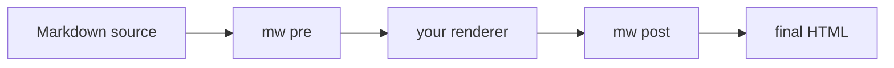

# Pipeline Guide

The `mw` CLI lets you use markwright syntax in a toolchain that is not built on Python-Markdown.
It brackets your existing renderer with two filters: a pre stage that runs on Markdown source, and a post stage that runs on the rendered HTML.
This page covers the model and shows worked Hugo and plain-Unix examples.

For the per-flag reference, see the [CLI Reference](cli.md).

## The Pre / Render / Post Model

Every markwright feature decomposes into at most two pure string transforms.
A source-stage transform takes Markdown text and returns Markdown with embedded HTML and marker comments.
An HTML-stage transform takes rendered HTML and returns rendered HTML.
Your renderer runs between them.



The pre stage expands the embed directives and extracts fence directives into an `mw-fence` comment.
Your renderer turns Markdown into HTML, passing the raw HTML and the comments through.
The post stage applies highlight, fence labels and prefixes, and one-time embed scripts.

## When to Run Only Post

You do not always need both stages.

Run **both stages** when your source contains pre-stage syntax: embed directives like `[youtube ID]`, or fence directives like `[label deploy.sh]`.
The pre stage has to expand those before your renderer sees them.

Run **only the post stage** when your HTML already carries the embed markup and any highlight markers, and you want the post-stage styling and script injection.
The post stage detects each embed's class signature on its own, so it injects scripts for hand-authored embeds with no pre-stage marker.
Highlight is also complete in the post stage: after a render, both prose and in-code markers surface as escaped text, and a single post pass handles both.

Run **only the pre stage** when you want prose highlights resolved to `<mark>` before your renderer runs, and nothing else.

The two stages are safe to combine.
Pre resolves prose highlights, post resolves whatever markers remain, and running post twice changes nothing.

## Plain Unix Example

The shortest path is a single pipe:

```bash
mw pre < in.md | cmark --unsafe | mw post > out.html
```

`cmark --unsafe` is [CommonMark](https://github.com/commonmark/cmark) with raw-HTML passthrough enabled, which the expanded embeds require.
To run a subset, pass matching flags to both stages:

```bash
mw pre --exclude twitter --exclude instagram < in.md \
  | cmark --unsafe \
  | mw post --exclude twitter --exclude instagram > out.html
```

If your source has no embed or fence directives and you only want highlight styling, restrict the run to that extension.
Set it once in a config file both stages discover:

```toml
# markwright.toml
enable = ["highlight"]
```

```bash
cmark --unsafe < in.md | mw post > out.html
```

See [Configuration](config.md) for the file format and precedence.

## Hugo

Hugo is a worked, tested instance of this model, with Goldmark as the renderer.
See the [Hugo integration guide](integrations/hugo.md) for the exact `hugo.toml` settings and a build script that brackets a real site.
