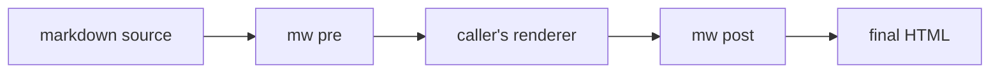
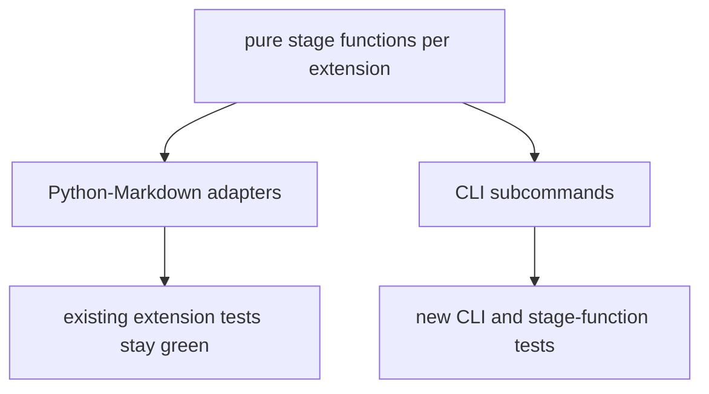

# Spec: markwright Pipeline CLI

A single command-line tool that exposes the markwright extensions as pre- and post-processing stages, so their markdown syntax works in any toolchain or language, beyond the Python-Markdown render they require today.

## Problem and Context

The markwright extensions are Python-Markdown extensions today.
They only run inside a `markdown.Markdown` render, which means only Python consumers can use them.
A friend running a Go/Hugo pipeline (and, more generally, anyone running a markdown toolchain in another language) wants to drop markwright syntax into their existing chain.

Markdown toolchains commonly compose ordered steps that each transform a document and pass it on.
The natural integration point for an external tool is a pair of filters: a pre stage that runs on markdown source before the core renderer, and a post stage that runs on the rendered HTML after it.
This spec defines a single CLI that provides both stages, lets the user pick which extensions run, and makes no assumptions about which renderer sits in the middle.

This is deliberately renderer-agnostic.
Hugo was the motivating example, but the tool special-cases nothing about Hugo.

## Goals

- One CLI binary with subcommands for the pre stage, the post stage, and a standalone full render.
- Let the caller select individual extensions to run (`--use youtube --use highlight`), defaulting to all.
- Behave as a Unix filter: read stdin, write stdout, composable in any pipe.
- Stay renderer-agnostic: the pre and post stages coordinate through markers that survive a normal markdown render, not through knowledge of the renderer.
- Reuse the existing, tested extension logic without changing its behavior inside Python-Markdown.
- Preserve the project bar: mypy strict, ruff clean, 100% test coverage.

## Non-Goals

- Not a port to Go or Goldmark. This wraps the existing Python code.
- Not a format-neutral AST. Output is HTML, the same as the extensions produce now. Multi-format output is a separate, larger project and is out of scope.
- Not a markdown parser. The core markdown-to-HTML step is the caller's renderer; this tool only brackets it.
- Not Hugo-specific. No shortcode emission, no Hugo config coupling, no `public/` directory walking baked in.

## Users and Use Cases

1. A Go/Hugo author who wants markwright code labels, environments, line prefixes, and `<^>highlight<^>` in their content, plus the embeds.
2. A Node/unified author who wants to bracket their remark pipeline with markwright syntax support.
3. A plain Unix pipeline: `mw pre < in.md | some-renderer | mw post > out.html`.
4. A Python consumer who keeps using the extensions in-process and ignores the CLI entirely (unchanged path).

## Design Overview

The core idea is that every markwright feature decomposes into at most two pure string transforms: a source-stage transform (markdown text in, markdown-plus-HTML text out) and an HTML-stage transform (rendered HTML in, rendered HTML out).
The caller's renderer runs between them.



The pre stage expands source-level syntax (the embeds) and extracts fence directives into a marker comment.
The renderer turns markdown into HTML, passing through the raw HTML and the marker comments.
The post stage applies the HTML-level transforms (highlight, fence labels and prefixes) and injects any one-time embed scripts.

### Stage Matrix

Derived from the current extension registrations.

| Extension | Pre stage (source to source+HTML) | Post stage (HTML to HTML) | Cross-stage coordination |
|---|---|---|---|
| youtube | expand `[youtube ...]` to iframe HTML | none | none |
| slideshow | expand `[slideshow ...]` to markup | none | none |
| image_compare | expand `[image_compare ...]` to markup | none | none |
| codepen | expand `[codepen ...]` to embed markup | inject `ei.js` once | post detects `class="codepen"` |
| twitter | expand `[twitter ...]` to blockquote | inject `widgets.js` once | post detects `class="twitter-tweet"` |
| instagram | expand `[instagram ...]` to blockquote | inject `embed.js` once | post detects `class="instagram-media"` |
| fence | extract directives and flags to `<!-- mw-fence:{JSON} -->`, keep the fence | apply label divs, CSS classes, `<ol><li data-prefix>` | the `mw-fence` comment |
| highlight | optional: wrap prose `<^>...<^>` in `<mark>`, skipping code regions | wrap remaining `&lt;^&gt;...&lt;^&gt;` runs in `<mark>`, span-safe | markers left for post |

Two coordination mechanisms, both renderer-agnostic:

- Script injection uses signature detection. The post stage scans the rendered HTML for the embed's class signature and appends the matching script tag exactly once. This needs no marker from the pre stage, so it also works on hand-authored embeds.
- Fence styling uses a marker comment. The pre stage encodes directives as `<!-- mw-fence:{JSON} -->`, which a conformant renderer passes through untouched. The post stage reads the comment and styles the adjacent code block.

### How Highlight Runs in Both Stages

Highlight participates in both stages, and the caller chooses which to run.

- The post stage is the complete path on its own. After an external render, both prose and code markers surface as escaped text (`&lt;^&gt;...&lt;^&gt;`), so a single post transform handles both, using the span-boundary-safe wrapping that keeps `<mark>` from crossing syntax-highlight `<span>` tokens. The post stage accepts markers in both escaped (`&lt;^&gt;`) and raw (`<^>`) form, since renderers differ in how they emit an unrecognized angle sequence.
- The pre stage is an opt-in convenience for callers who want prose highlights resolved to `<mark>` before render. It wraps `<^>...<^>` only outside fenced and inline code regions and leaves the in-code markers untouched for the post stage, because highlighting inside code requires the post-render span handling. Pre-stage `<mark>` is raw HTML and so depends on the renderer passthrough requirement below.

Running both stages is safe and idempotent: pre resolves prose, post resolves whatever markers remain (the in-code ones). Running only post does everything. Running only pre does prose only.

## CLI Contract

The command is `mw`.

```
mw pre    [--use NAME ...] [--exclude NAME ...]
mw post   [--use NAME ...] [--exclude NAME ...] [--warn]
mw render [--use NAME ...] [--exclude NAME ...]
mw list
mw --version
```

- `pre` reads markdown, writes markdown with embedded HTML and marker comments.
- `post` reads HTML, writes HTML with markwright styling and scripts applied.
- `render` runs the full markdown-to-HTML pipeline in one shot, using the existing Python-Markdown path. This is the standalone renderer for callers who do not have their own.
- `list` prints every extension with the stage(s) it participates in.

Behavior:

- The MVP is a pure stdin-to-stdout filter. Every transform subcommand reads stdin and writes stdout, so it composes in any pipe. File arguments and in-place batch editing are deferred to a later enhancement and are explicitly out of MVP scope.
- `--use` is repeatable and selects extensions; the default is all extensions. `--exclude` removes from the selected set.
- Selection order does not matter; stages always run in the extensions' defined priority order, matching the in-process behavior.
- Input and output are UTF-8.
- Exit codes: 0 on success, 1 on input or IO error, 2 on usage error (argparse default).
- Errors go to stderr and fail loud; the tool does not silently swallow a bad selection or malformed input.

### The `--warn` Flag

`--warn` is a `post` diagnostic. When set, the post stage writes advisory warnings to stderr for markers and signatures it sees but cannot fully apply. It changes no output and does not affect the exit code (warnings stay advisory; exit 0).

It reports only what a post-only filter can actually detect:

- A malformed `mw-fence` JSON payload (skipped, not executed).
- A marker whose `version` the running tool does not support.
- A marker with no adjacent code block to style.

It cannot report the comment-stripping case. Once a renderer drops the `mw-fence` comment, the post stage has no evidence the directive ever existed, so a stripped marker is silently absent rather than a detectable skip. That failure mode is covered by the documented renderer-requirements contract below, not by runtime detection. Without `--warn`, all of these conditions are a silent graceful no-op (the default).

### Renderer Requirements (Documented Contract)

For the pre and post stages to round-trip correctly, the caller's renderer between them must:

1. Pass raw HTML blocks through (needed for expanded embeds). Renderers that strip raw HTML by default require their passthrough option enabled.
2. Preserve HTML comments (needed for the `mw-fence` marker). A renderer that drops comments disables fence styling but does not break anything else.
3. Wrap syntax-highlighted code tokens in tags (needed for in-code highlight). Any Pygments- or Chroma-style highlighter qualifies.

These are stated plainly in the docs so a user can predict which features survive their specific chain.
The post stage degrades gracefully: if a marker or signature is absent, that feature is a no-op rather than an error.

## Marker Contract (`mw-fence`)

The fence directives travel from `pre` to `post` as an HTML comment placed immediately before the fence: `<!-- mw-fence:{JSON} -->`.
The fence itself is left intact, so the caller's renderer still sees and syntax-highlights the real code; there is no placeholder and no rewritten language token.
Post associates a marker with the code block that immediately follows it, the same adjacency rule the in-process postprocessor already uses.
This comment is the only cross-tool surface, so its shape is a versioned contract.

### v1 Payload

```json
{
  "version": 1,
  "label": "deploy.sh",
  "secondary_label": "optional second label",
  "environment": "local",
  "prefix_type": "command",
  "prefix_value": "$"
}
```

`version` is an integer and the only required field.
Every other field is optional and present only when the author used that directive.
`prefix_type` is one of `line_numbers`, `command`, `super_user`, or `custom_prefix`; `prefix_value` carries the rendered prefix (`$`, `#`, or custom text) and is absent for `line_numbers`.
Post applies whatever fields are present and ignores any it does not recognize.

### Versioning Policy

Best-effort, backward compatible, and fail-soft:

- The schema grows additively. New optional fields do not bump `version`; only a breaking change (a removed field or a changed meaning) does.
- Post reads any marker whose `version` it knows (currently only `1`) and ignores unknown fields, so a newer `pre` that only added fields still works with an older `post`.
- A marker whose `version` is greater than post knows is skipped as a no-op and reported under `--warn`. Post never guesses at a schema it does not know.
- A malformed payload (invalid JSON, or a missing or wrongly typed required field for the claimed version) is skipped, never executed, and reported under `--warn`.

This mirrors the project-wide rule that an unreadable or absent marker degrades to a no-op rather than an error.

## Implementation Strategy

Refactor each extension into pure, stage-tagged functions, then make the existing `Extension` classes thin adapters over them.
This keeps every current test green and adds a second consumer (the CLI) over the same logic.



- Each module exposes functions such as `expand_source(text) -> text` and/or `apply_html(html) -> html`.
- A registry maps extension name to `{pre: fn | None, post: fn | None, priority: int}`.
- `pre` composes the selected `pre` functions in priority order over the input; `post` composes the selected `post` functions; `render` builds a `markdown.Markdown` with the selected extensions (the existing path).
- The `mw-fence` marker format becomes a public contract once it crosses the pipeline boundary, so it gets a `version` field and a documented schema.

Packaging: add a `[project.scripts]` entry point (`mw = "markwright.cli:main"`).
Use stdlib `argparse`, consistent with the project's stdlib-first, low-dependency stance.

## Edge Cases and Failure Modes

- Empty input produces empty output, no error.
- Input with no markwright syntax passes through unchanged at every stage.
- `post` run on HTML the `pre` stage never touched still injects scripts for hand-authored embeds via signature detection.
- Idempotency: running `post` twice must not double-inject a script (detect an already-present script tag) or double-wrap a mark (the markers are gone after the first pass). This is a tested requirement.
- A renderer that strips HTML comments leaves fence code blocks unstyled; the post stage skips them silently. This case is undetectable by `--warn` (the marker is simply gone) and is documented in the renderer-requirements contract.
- The `\<^>` escape survives both stages and renders as a literal marker, as it does in-process today.
- Malformed or adversarial marker comments are validated before use; a bad JSON payload is skipped, not executed, and reported under `--warn`.

## Testing Approach

- Keep the existing per-extension tests unchanged; they pin the in-process behavior the adapters must preserve.
- Add stage-function tests that call the pure `expand_source` / `apply_html` functions directly.
- Add CLI tests that drive each subcommand over stdin and assert stdout, plus selection flags and exit codes.
- Add `--warn` tests: a malformed payload, an unsupported version, and a marker with no matching code block each emit a stderr warning while leaving stdout and the exit code unchanged.
- Add a round-trip integration test: `pre` output fed through a minimal stub renderer (a real Python-Markdown render with raw-HTML and comment passthrough) and then `post`, asserting the final HTML matches the in-process `render`.
- Maintain 100% coverage; `just check` stays the gate.

## Milestones

1. Refactor extensions into pure stage functions plus thin adapters. No behavior change, all existing tests green.
2. Stage registry and the `list` subcommand.
3. `post` subcommand: highlight, fence apply, signature-based script injection, and the `--warn` diagnostics, with tests.
4. `pre` subcommand: embed expansion, fence directive extraction, with tests.
5. `render` subcommand over the existing pipeline, with tests.
6. Cross-stage round-trip integration tests.
7. Docs: CLI reference, pipeline integration guide, the renderer-requirements contract.
8. Packaging: console-script entry point and a smoke test that the installed command runs.

## Risks

- Renderer assumptions (HTML passthrough, comment survival, span-based highlighting) will not hold in every chain. Mitigate with the documented contract, graceful degradation, and the `--warn` mode that reports markers the post stage cannot apply.
- The refactor could regress tested behavior. Mitigate by keeping adapters thin and running `just check` at each milestone.
- The `mw-fence` marker becomes a cross-tool contract. Mitigate by versioning the payload and validating it on read.
- One-time script injection is easy to get wrong (double injection, wrong order). Mitigate with idempotency tests and a single, central injection step in `post`.

## Future Directions (Deferred, Not in Scope for MVP)

The MVP emits HTML.
The refactor into pure stage functions over each construct's structured form is chosen partly to keep other render targets open without a teardown later.

- Agent-readable output. A static site that serves raw markdown to LLM agents wants the markwright syntax resolved into something legible, since `[youtube abc]` and `<^>foo<^>` are presentational noise an agent cannot interpret. This is a clean-text or clean-markdown render target (for example `[youtube abc]` to a plain `Video: <url>` line, `<^>name<^>` to just `name`), not a data format. It is a second serializer over the same structured constructs.
- Structured JSON of the markwright constructs, for tools that want to inspect what syntax is present rather than consume HTML. Cheap on the current substrate because the data already exists internally (embed flag dicts, the fence metadata that is already JSON-serialized into its marker).
- A format-neutral whole-document AST with JSON serialization and multi-format rendering. This is a foundation change, not an output mode; it would mean reimplementing the features as `markdown-it-py` plugins (the Python port of the same `markdown-it` engine the original do-markdownit is built on), and is tracked only as a possible long-term direction.
- A marker encoding that survives comment-stripping renderers. The MVP carries fence directives in an HTML comment, which a strict sanitizer can drop. If a real chain needs it, a passthrough-element encoding (a hidden element with a `data-mw-fence` attribute, riding the raw-HTML passthrough the embeds already require) can carry the same payload past comment stripping. Deferred until a user's renderer actually requires it; the comment stays the default.

The design rule that preserves all three: stage functions must not bury a construct's structured data inside an HTML string before it is needed. Keep the structured form reachable; let serialization be the last step.

## Resolved Decisions

- CLI command name is `mw`.
- The fence marker is an HTML comment with a versioned JSON payload placed before the fence (see Marker Contract). Its policy is best-effort and fail-soft: unknown fields are ignored, and an unsupported `version` or malformed payload is skipped and warned, never guessed.
- `--warn` is in the MVP. It is a `post`-stage diagnostic that reports only detectable problems (malformed marker JSON, an unsupported marker version, or a marker with no matching code block). Comment-stripping is undetectable by a post-only filter and is covered by the renderer-requirements contract instead.
- The MVP is stdin-to-stdout only. File arguments and in-place `--write` are deferred.
- The pre stage requires the caller's renderer to allow raw HTML passthrough; there is no placeholder-rehydrate mode in the MVP. This is stated in the renderer-requirements contract.
- Highlight participates in both stages: an opt-in pre mode for prose and a complete post mode that also covers in-code highlights.

## Open Questions

None block the MVP. The two earlier questions are now settled:

- Marker version policy: resolved as best-effort and fail-soft (see Marker Contract). The only forward-looking piece, the exact policy when a real v2 marker ships, does not affect the v1 MVP.
- Surviving comment-stripping renderers: a parked enhancement (see Future Directions), not an MVP gap.
